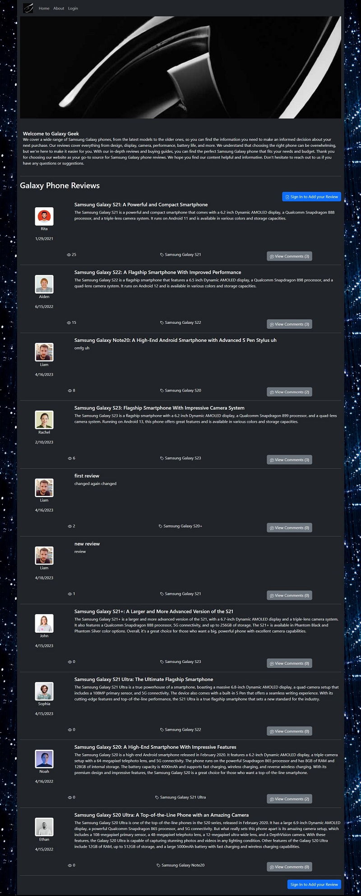

# GALAXY GEEK
Tech blog website where you can post reviews or comments for all your Galaxy devices.

[](https://opensource.org/licenses/MIT)

## Installation
To install this project, clone the repository to your local machine and run the following commands:

``` 
npm install
```
## Usage
To start the server, run the following command:
``` 
npm start
```
This will start the server on http://localhost:3001.

## Seed Databases by running:
``` 
npm start seed
```
This will load all databases with some test data

## Website Link
https://galaxy-geek.herokuapp.com/


## Screenshot

Galaxy Geek


## Skills on display
- MySQL 
  - select
  - delete
  - update
- GET/PUT/POST/DELETE API Routes
- Sequelize
- Handlebars

